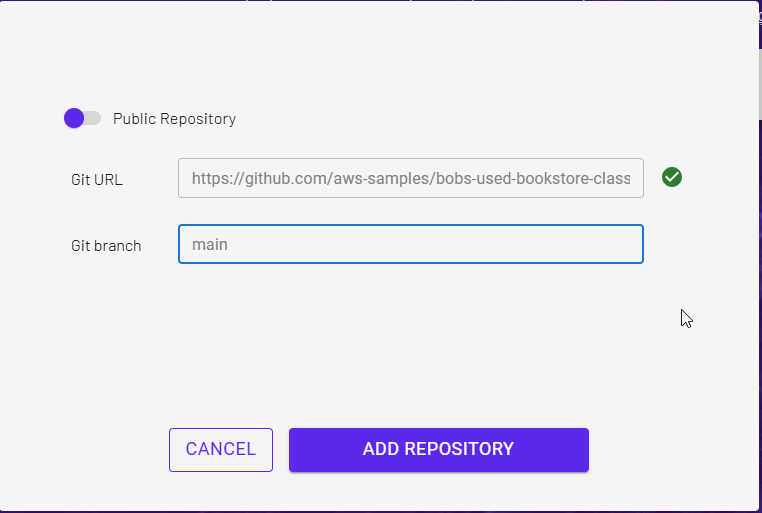
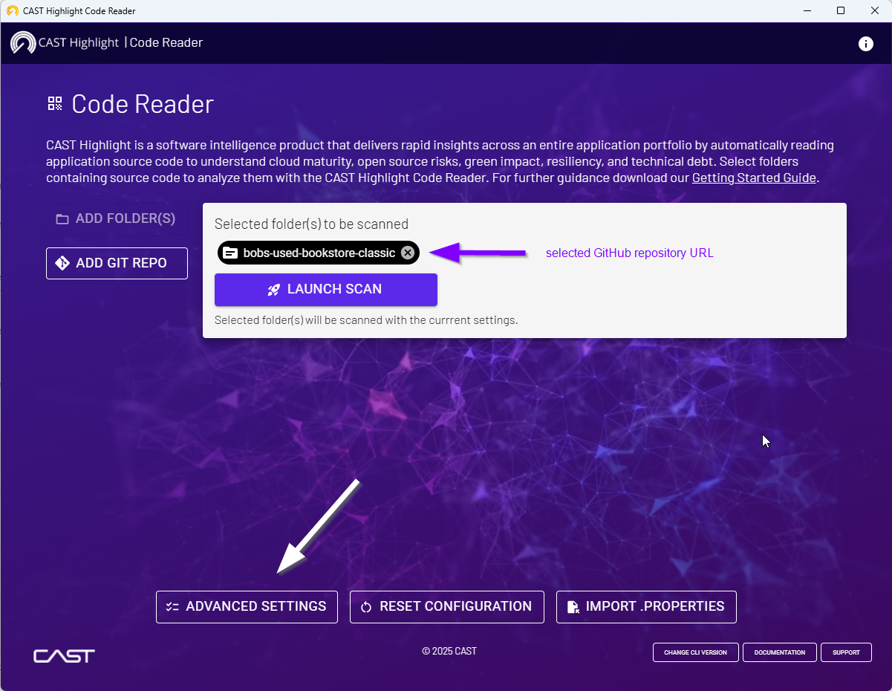
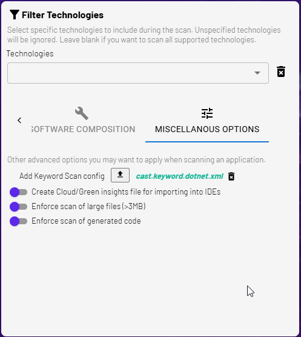
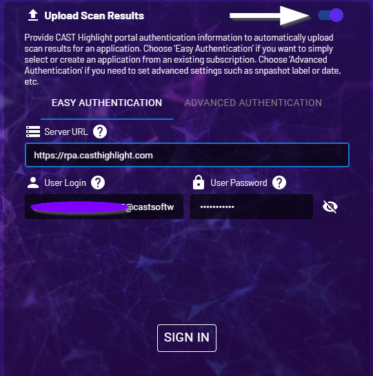
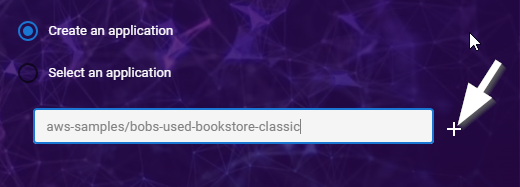
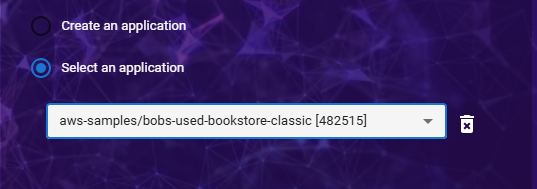
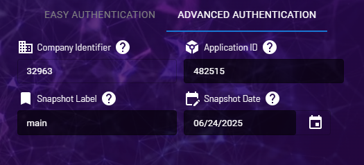

# Extract the "AWS Transform: Advisor for .Net Applications" recommendations from CAST Highlight into JSON files for an upload in AWS Transform

This Python script automatically extracts the recommendations from "AWS Transform: Advisor for .Net Applications" into JSON files. It will generate one JSON file with all the recommended waves and one JSON file per wave.
Those JSON files follow a format that will allow users to upload them directly in AWS Transform to help selecting the .Net repositories to be automatically upgraded in the latest .Net version.    

This script just takes as an input a token to connect to a CAST Highlight account.
The default CAST Highlight URL is https://rpa.casthighlight.com, but you can select another one like ,https://cloud.casthighlight.com or https://app.casthighlight.com 

## CAST Highlight Code Scan Pre-requisites
1. Repository vs Application: since AWS Transform works at the source code repository level, CAST Highlight code scans must also be done at the source code repository level and not at the application level. For example, if an application is composed of 3 GitHub repositories, the 3 GitHub repositories must be scanned separately and the 3 code scan results must be uploaded in 3 different _applications_ in the CAST Highlight platform.
2. CAST Highlight application name must follow a specific naming convention : _repository_id\repository_name_. For example, for the Github repository "https://github.com/aws-samples/bobs-used-bookstore-classic", the application name in CAST Highlight must be "aws-samples/bobs-used-bookstore-classic".
3. Ideally, the name of the code scan _snapshot_ should be the name of the scanned repository _branch_. Most of the time, the name of the scanned branch is the default name like "_main_"  

### An example on how to scan GitHub repositories to match those pre-requisites  
#### 1. From the Code Reader home screen, add the GitHub Repository URL and branch name to scan 


#### 2. Go to the _Advanced Settings_ screen


#### 3. Go to the _Miscellaneous Options_ tab, select the "cast.keyword.dotnet.xml" for the _Add KeyWord Scan Config_ option
_.Net Version Check_ extension : https://doc.casthighlight.com/extensions/download.php?identifier=cast.keyword.dotnet  


#### 4. Activate the _Upload Scan Results_ option, enter the login credentials to the CAST Highlight instance (Easy Authentication or Advanced Authentication) and click on _Sign In_


#### 5. Select _Create an application_, enter the application name **following the naming convention described above**  (repo_id/repo_name) and click on the + button


#### 6. Select the newly created application (you can see its ID) in the drop-down list then go to the _Advanced Authentication_ tab


#### 7. In the _Advanced Authentication_ tab, fill the _Snapshot Label_ field with the **branch name** of the repository to scan and select the proper Snapshot date then finally hit the _Save Settings_ button followed by the _Launch Scan_ button 


## ⚙️ Installation

### 0. Pre-requisites
Python 3.13.3 or later (Python 3.09 and 3.10 not supported)

### 1. Set up the virtual environment

```bash
python -m venv venv
```
```bash
source venv/bin/activate      # macOS / Linux
venv\Scripts\activate         # Windows
```

### 2. Install the dependencies

```bash
pip install -r requirements.txt
```
##  Main steps of the script in execution order
1. Retrieve the command line parameters
2. Set up the analysis environment by creating several folders
3. Use the CAST Highlight API and the CAST token to retrieve the company id of the CAST Highlight account
4. Create or update the "AWS Transform: Advisor for .Net Applications" segmentation in CAST Highlight
5. Retrieve the list of applications onboard in CAST Highlight, only applications with the status "Complete"
6. Compute the "AWS Transform: Advisor for .Net Applications" segmentation and retrieve the list of applications for rach segment
7. Generate the JSON files: one JSON with all the segments/waves and one JSON file per waves (6 maximum)
 
## 🖥️ Python Script - CLI Usage

### Help
```bash
python .\CastAWSTransformAdvisorExtraction.py --help

usage: CastAWSTransformAdvisorExtraction.py [-h] --cast-token CAST_TOKEN

Extract the "AWS Transform: Advisor for .Net Applications" recommendations from CAST Highlight

options:
  -h, --help                  show this help message and exit
  --cast-token CAST_TOKEN     CAST Highlight token
  --cast-url CAST_URL         CAST Highlight URL - default is https://rpa.casthighlight.com
                              Other possible CAST Highlight URLs: 
                                  https://cloud.casthighlight.com
                                  https://app.casthighlight.com
                                  https://demo.casthighlight.com
```
 
### Example using the default CAST Highlight URL (rpa.casthighlight.com)
```bash
python .\CastAWSTransformAdvisorExtraction.py --cast-token <your-CAST-Highlight-token>
```

### Example using another CAST Highlight URL
```bash
python .\CastAWSTransformAdvisorExtraction.py --cast-token <your-CAST-Highlight-token> --cast-url https://demo.casthighlight.com
```

## Author
Created by fcnico98 (n.bidaux@castsoftware.com)
